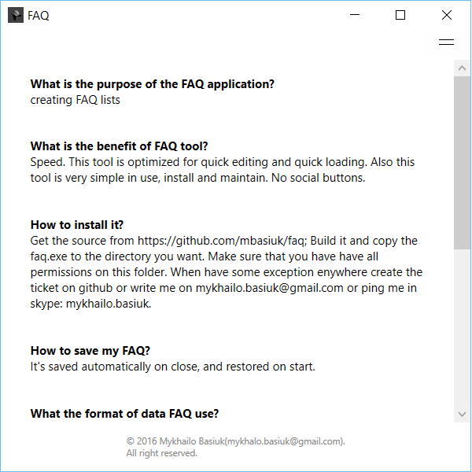
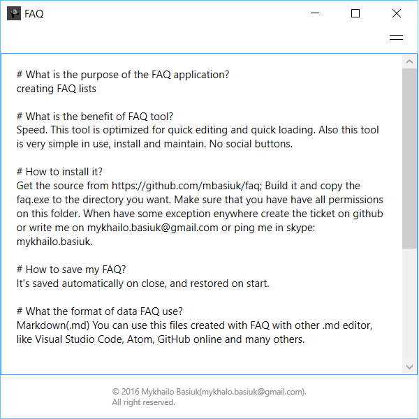
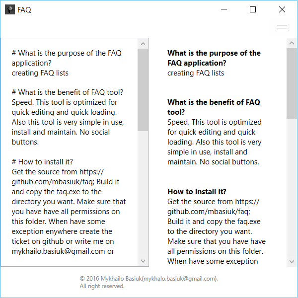

# FAQ

## Faq is a tool to editing Faq (Frequently Asked Questions).
## I created this tool and use it for collection my FAQ related to new project - arhitecture details, some deploing steps, tables, classes, SP that used often. This tool help me to save huge amount of time - I ask some info in my teammates, search in mailbox, skype, etc. <s> only once</s>, max twice. Then I note it to my tool.

### FAQ is very fast and optimized for both mouse and keyboard. This following screenshot show the FAQ in view mode:

## FAQ in the edit mode:   

## FAQ in the mixed mode:   
